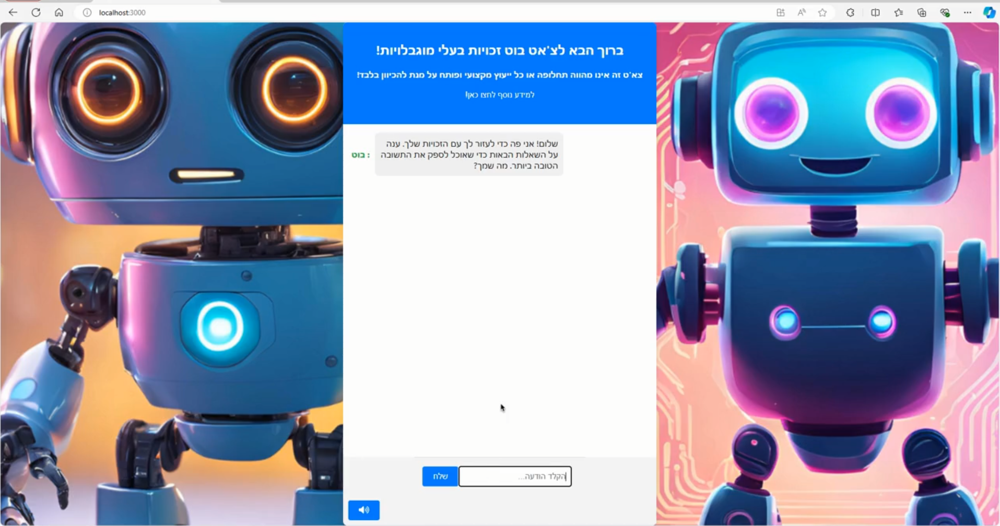

#Chatbot-for-the-rights-of-people-with-disabilities
The project was created as part of the course "Applied Accessibility for Software Engineers," under the guidance of Attorney Eitan Amram, according to his requirements.

[Watch the Demo video](demo.mp4)

## Authors: 

Pavel Kormilchik kormilchikpavel@gmail.com

Orel Maier orelmaier@gmail.com
